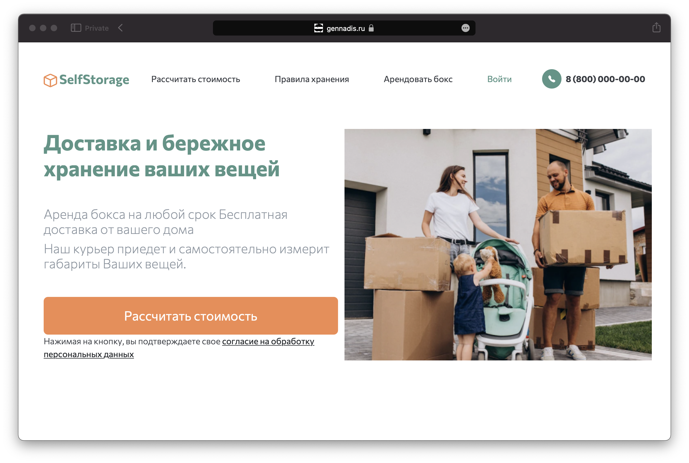

# Сервис SelfStorage



Николай, предприниматель, владеет сетью складов для юридических лиц в Москве. Узнал о проекте https://cherdak.io/ и решил, что он тоже так может! 

Сезонные вещи, занимающие много места в квартире не всегда удобно хранить, во многих случаях места в квартире для них нет, также бывает, что вещи надоедают, но избавляться от них жалко - они накапливаются и занимают все пространство, мешая жить. Аренда небольшого склада решит эту проблему.

Николаю такое выгодно: сможет заполнять остающиеся пространства от крупных компаний небольшими контейнерами для физ. лиц.

## Ценность:

- **Для клиента:**  
Хранение сезонных, крупных вещей: снегоход, лыжи, сноуборды
Хранение вещей на время переезда
Освобождение домашнего пространства от вещей, которые занимают много места, но ценны для хозяев и им хочется их сохранить

- **Для владельца приложения:**  
Дополнительный заработок за счёт использования небольших секций уже приобретенных им помещений.
Тестирование нового канала продаж: сейчас от сайта ожидается только MVP, чтобы проверить спрос и найти аудиторию.

---

# Инструкция по установке

1. Клонируйте репозиторий и перейдите в созданную директорию
```sh
git clone https://github.com/gennadis/self-storage.git
```

2. Скопируйте файл `.env.dev.example` и заполните его по образцу
```sh
cp .env.dev.example src/selfstorage/.env && nano src/selfstorage/.env
```

```
SECRET_KEY=<secret_key>
DEBUG=True
ALLOWED_HOSTS=127.0.0.1,localhost

YOOKASSA_API_KEY=<yookassa_api_key>
YOOKASSA_SHOP_ID=<yookassa_shop_id>

# set True for SQLite or False for PostgreSQL
USE_SQLITE=False

POSTGRES_USER=storage_user
POSTGRES_PASSWORD=storage_password
POSTGRES_DB=storage_db

EMAIL_URL=smtp+tls://user@gmail.com:passw0rd@smtp.gmail.com:587
DEFAULT_FROM_EMAIL=user@gmail.com

```

3. Соберите и поднимите проект с помощью `docker compose`
```sh
docker compose -f docker-compose.dev.yaml up -d --build
```

4. Запустите команды для наполнения БД тестовыми данными
```sh
docker compose -f docker-compose.dev.yaml exec django python manage.py load_warehouses https://raw.githubusercontent.com/aosothra/remote_content/master/self_storage/warehouses.json
```

```
docker compose -f docker-compose.dev.yaml exec django python manage.py generate_boxes
```

5. Создайте суперпользователя
```
docker compose -f docker-compose.dev.yaml exec backend python manage.py createsuperuser
```

6. Запустите сервер и откройте сайт в браузере по адресу [http://127.0.0.1:8000/](http://127.0.0.1:8000/)


В дополнение к пользовательской части сайта, также доступны следующие страницы для менеджера:
- [панель управления просроченной арендой](127.0.0.1:8000/overdue)

- [панель управления доставкой](127.0.0.1:8000/delivery)
