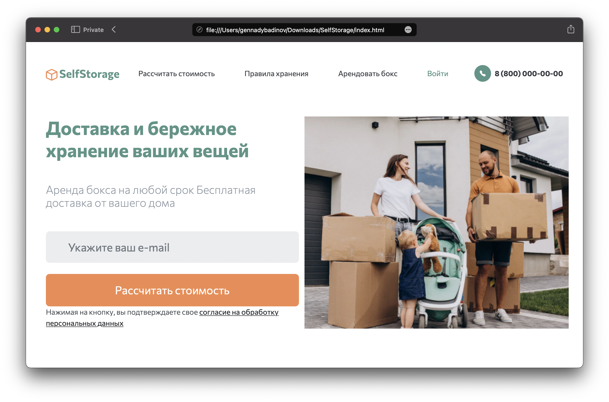

# Сервис SelfStorage



Николай, предприниматель, владеет сетью складов для юридических лиц в Москве. Узнал о проекте https://cherdak.io/ и решил, что он тоже так может! 

Сезонные вещи, занимающие много места в квартире не всегда удобно хранить, во многих случаях места в квартире для них нет, также бывает, что вещи надоедают, но избавляться от них жалко - они накапливаются и занимают все пространство, мешая жить. Аренда небольшого склада решит эту проблему.

Николаю такое выгодно: сможет заполнять остающиеся пространства от крупных компаний небольшими контейнерами для физ. лиц.

## Ценность:

- **Для клиента:**  
Хранение сезонных, крупных вещей: снегоход, лыжи, сноуборды
Хранение вещей на время переезда
Освобождение домашнего пространства от вещей, которые занимают много места, но ценны для хозяев и им хочется их сохранить

- **Для владельца приложения:**  
Дополнительный заработок за счёт использования небольших секций уже приобретенных им помещений.
Тестирование нового канала продаж: сейчас от сайта ожидается только MVP, чтобы проверить спрос и найти аудиторию.

---

# DEV instructions

1. Скачайте код
```sh
git clone https://github.com/gennadis/self-storage.git
```

2. Перейдите в каталог проекта
```sh
cd self-storage
```

3. В каталоге проекта создайте виртуальное окружение
```sh
python3 -m venv venv
```

4. Активируйте его
```sh
source venv/bin/activate
```

5. Установите зависимости
```sh
pip install -r requirements.txt
```

6. Накатите миграции
```sh
python manage.py migrate
```

7. Переименуйте файл `.env.example` на `.env` и заполните его
```sh
mv .env.example .env
```
- `DEBUG` — дебаг-режим, `True` или `False`
- `SECRET_KEY` — секретный ключ проекта
- `ALLOWED_HOSTS` — [см. документацию Django](https://docs.djangoproject.com/en/3.1/ref/settings/#allowed-hosts)

8. Запустите сервер и откройте сайт в браузере по адресу [http://127.0.0.1:8000/](http://127.0.0.1:8000/)

```sh
python manage.py runserver 127.0.0.1:8000
```
